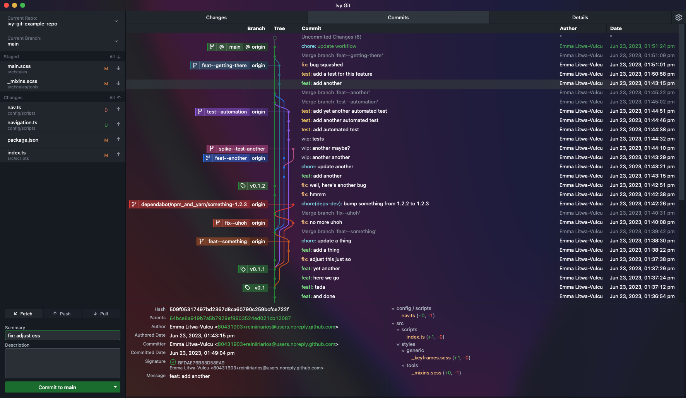
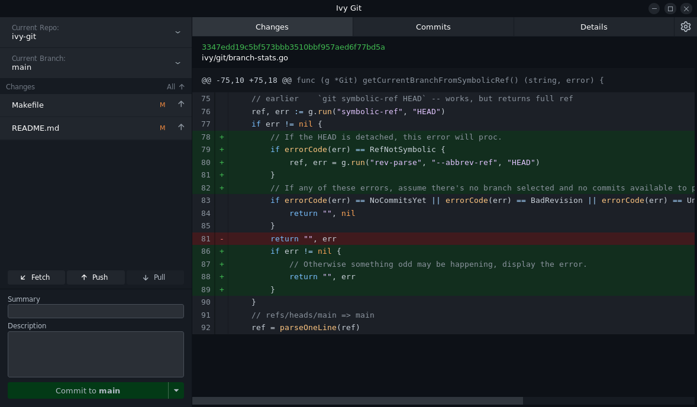

# 🍃 Ivy Git

Ivy Git is a work-in-progress Git GUI that aims to simplify workflow by putting the least amount of resistance between the user and git as possible, enabling diverse workflows without the constraints of being opinionated.

It is built on [Wails](https://wails.io/) in [Go](https://go.dev/), [Svelte](https://svelte.dev/), [Typescript](https://www.typescriptlang.org/), and [SCSS](https://sass-lang.com/documentation/syntax/), using [Vite](https://vitejs.dev/) and [WebView2](https://developer.microsoft.com/en-us/microsoft-edge/webview2/) for the frontend.

**[➡ Download Latest Release](https://github.com/reiniiriarios/ivy-git/releases/latest)**





[📸 See More Screenshots](./docs)

## Major Features

- Tree View
- View file diffs/changes (current, staged, and commit history)
- Stage/Unstage files
- Stage/Unstage partial files by changed line
- Write and amend commits or stash changes
- Merge & Rebase
- Resolve conflicts when merging and rebasing
- Fetch/Push/Pull
- Manage branches
- CLOC (Count Lines of Code)
- Contributors list for repositories (WIP)
- Highlight Conventional Commit tags
- Select from three configurations: Merge Commits, Squash & Rebase, or Rebase Everything. Setting changes actions available in context menu.
- Cherry pick commits
- Add, remove, push tags
- Manage remotes
- Quickly set author information in git config per repo

## Building from Source / Development

### Linux Dependencies

Dependency|Package|Install
---|---|---
gcc|build-essential|package manager
Go 1.21|golang-1.21|package manager
Docker|docker.io|package manager
libgtk-3|libgtk-3-dev|package manager
libwebkit|libwebkit2gtk-4.0-dev|package manager
pkg-config|pkg-config|package manager
Node.js/npm|nodejs|package manager / [nvm](https://github.com/nvm-sh/nvm)

### macOS Dependencies

Dependency|Package|Install
---|---|---
Xcode|xcode|[Apple](https://apps.apple.com/us/app/xcode/id497799835)
Xcode cli tools|xcode|`xcode-select --install`
Docker|docker.io|Homebrew / [Docker](https://www.docker.com/products/docker-desktop/)
Go 1.21|golang-1.21|Homebrew / [go.dev](https://go.dev/dl/)
libgtk-3|libgtk-3-dev|Homebrew
libwebkit|libwebkit2gtk-4.0-dev|Homebrew
Node.js/npm|nodejs|Homebrew / [nvm](https://github.com/nvm-sh/nvm)

### Windows Dependencies

Dependency|Package|Install
---|---|---
Docker|Docker|winget / [Docker](https://www.docker.com/products/docker-desktop/)
Go 1.21|GoLang/Go|winget / [go.dev](https://go.dev/dl/)
NSIS|NSIS/NSIS|winget / [NSIS](https://nsis-dev.github.io/)
WebView2|Microsoft/EdgeWebView2Runtime|winget / [Microsoft](https://developer.microsoft.com/en-us/microsoft-edge/webview2/)
Node.js/npm|nodejs|[nvm](https://github.com/nvm-sh/nvm)

## Building

To build for your current platform, run from the `ivy-git` source directory:

```sh
make
make install
```

### Details

`make` will first install all Go and npm dependencies via `make deps`, including Wails. It will then call `make build` and build for your current system.

To build for a specific OS other than your own, you can run `make linux`, `make darwin`, or `make windows`. To build for Windows, builds, you'll need the additional `nsis` dependency.

### Linux

`make install` will copy the binary to `/usr/bin/ivy-git`, additional files to `/etc/ivy-git/*`, and a `.desktop` file to `/usr/share/applications/`.

### macOS

`make` will generate a universal app that should work on both x64 and amd (M1) chips. `make install` will create a `pkg` file that will install the app appropriately.

### Windows

`make install` will create both a zip file and an installer. If you have issues running `make install` on Windows, make sure Powershell is accessible from the shell you are using. Be aware: Running install from WSL will, as you might expect, build and install for Linux, not Windows.

### Troubleshooting

If you're having trouble getting Wails properly installed, see the [Wails Getting Started guide](https://wails.io/docs/gettingstarted/installation).

To check dependencies listed above, run `wails doctor` after installing Wails.

Node dependencies, including Svelte and Typescript, will be installed as a part of the build process. If you wish/need to manually install, you can run `npm ci` from the `/frontend` directory.

## Running in Development Mode

To run in live development mode, run `./run-dev.sh`. Via this script, the garbage collector will be configured correctly and debug mode enabled.

Alternatively, set the following environment variables and run `wails dev`.

#### Go Garbage Collector

In order for the garbage collector to run correctly, the following to environment variables must be set:

```sh
GOGC=100
GOMEMLIMIT=1000MiB
```

#### Debug Mode

To run in debug mode, set the following two environment variables:

```sh
IVY_GIT_DEBUG=true
GODEBUG=gctrace=1
```
