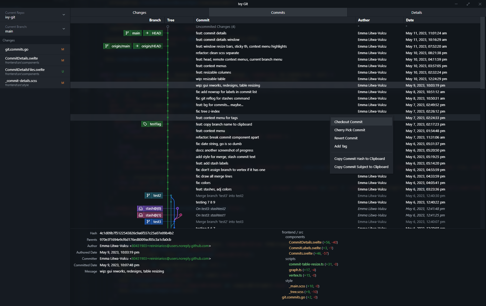

# Ivy Git

WIP Git Gui

## Development

To run in live development mode, run `wails dev` in the project directory.

## Building

To build a redistributable, production mode package, use `wails build`.
